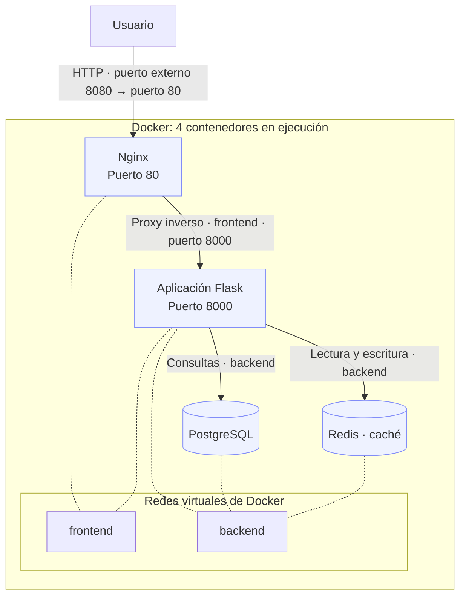

```mermaid
flowchart TB
    usuario["Usuario"]

    subgraph dockerStack["Docker: 4 contenedores en ejecución"]
        container1["Nginx<br/>Puerto 80"]
        container2["Aplicación Flask<br/>Puerto 8000"]
        container3[("PostgreSQL")]
        container4[("Redis · caché")]

        subgraph redes["Redes virtuales de Docker"]
            frontend["frontend"]
            backend["backend"]
        end

        container1 -->|"Proxy inverso · frontend · puerto 8000"| container2
        container2 -->|"Consultas · backend"| container3
        container2 -->|"Lectura y escritura · backend"| container4

        container1 -.- frontend
        container2 -.- frontend
        container2 -.- backend
        container3 -.- backend
        container4 -.- backend
    end

    usuario -->|"HTTP · puerto externo 8080 → puerto 80"| container1

    classDef container stroke:#818cf8,fill:#eef2ff
    class container1,container2,container3,container4 container
```