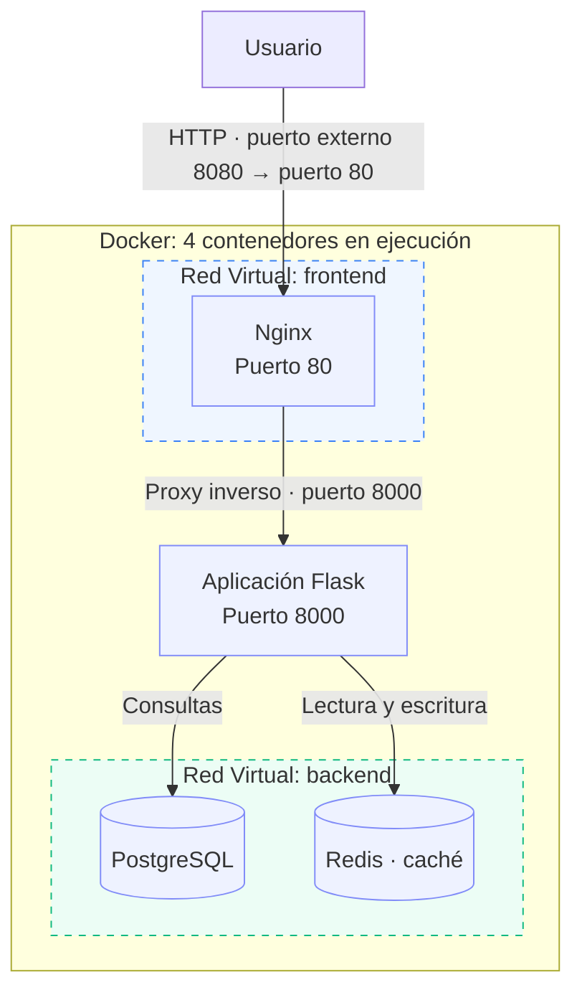

```mermaid
flowchart TD
    usuario["Usuario"]

    subgraph dockerStack["Docker: 4 contenedores en ejecución"]
        
        subgraph frontend["Red Virtual: frontend"]
            container1["Nginx<br/>Puerto 80"]
        end

        subgraph backend["Red Virtual: backend"]
            container3[("PostgreSQL")]
            container4[("Redis · caché")]
        end
        
        %% La aplicación vive en la intersección, pero la ponemos aquí visualmente
        container2["Aplicación Flask<br/>Puerto 8000"]

        container1 -->|"Proxy inverso · puerto 8000"| container2
        container2 -->|"Consultas"| container3
        container2 -->|"Lectura y escritura"| container4
    end

    usuario -->|"HTTP · puerto externo 8080 → puerto 80"| container1

    classDef container stroke:#818cf8,fill:#eef2ff
    class container1,container2,container3,container4 container
    
    style frontend stroke:#3b82f6,fill:#eff6ff,stroke-dasharray: 5 5
    style backend stroke:#10b981,fill:#ecfdf5,stroke-dasharray: 5 5
```